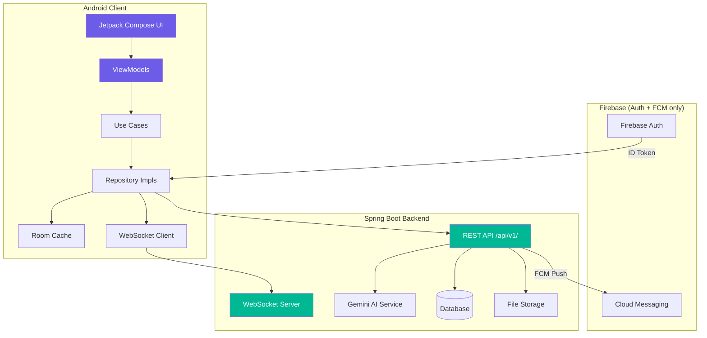

# HustleHub - Product Requirements Document (PRD)

<div align="center">


**Your Campus Marketplace**


[](https://developer.android.com)
[](LICENSE)

*Connecting campus hustlers with customers through trust, convenience, and innovation*

</div>

---

## 📋 Table of Contents

- [1. Executive Summary](#1-executive-summary)
- [2. Product Overview](#2-product-overview)
- [3. Features & Requirements](#3-features--requirements)
- [4. Technical Architecture](#4-technical-architecture)
- [5. UI/UX Requirements](#5-uiux-requirements)
- [6. Development Plan](#6-development-plan)
- [7. Testing & Deployment](#7-testing--deployment)
- [8. Risks & Mitigation](#8-risks--mitigation)
- [9. Success Metrics](#9-success-metrics)
- [10. Team & Resources](#10-team--resources)

---

## 1. Executive Summary

### 🎯 Vision
Transform the informal peer-to-peer service economy at Meru University into a structured, trustworthy, and engaging marketplace where students can discover services, build reputations, and connect safely.

### 🔍 The Problem
Students at Meru University offer diverse services—**laundry, salon, tutoring, graphic design, photography, food, tailoring**, and more. Today, this vibrant economy operates entirely through:
- **WhatsApp groups**: Chaotic, unsearchable, messages get buried
- **Word of mouth**: Limits provider reach to small circles
- **No trust layer**: Customers can't assess quality before committing
- **Privacy risks**: Students must share personal phone numbers
- **No organization**: Past transactions and conversations are lost

### 💡 The Solution
**HustleHub** is a native Android application that organizes this economy through:

| Feature | Benefit |
|---------|---------|
| 🔍 **AI-Powered Search** | "braids near Gate B under 500" → instant matches |
| 💬 **In-App Messaging** | Chat without sharing phone numbers |
| 🗺️ **Campus Map** | See available providers in real-time |
| ⭐ **Reputation System** | Ratings, reviews, and Hustle Score |
| 🎓 **Student-Only Access** | Verified via @must.ac.ke email |
| 📸 **Service Portfolios** | Showcase work with before/after images |

### 🎪 Core Principle
**Connect, don't control.** Providers set their own prices, schedules, and terms. We handle discovery, communication, and trust.

---

## 2. Product Overview

### 2.1 Problem Statement

| Problem | Impact | HustleHub Solution |
|---------|--------|-------------------|
| Services shared via WhatsApp groups | Impossible to search, messages buried | Categorized discovery feed + AI search |
| Word of mouth only | Limited provider reach | Campus-wide visibility for all providers |
| No reputation system | Cannot assess quality or reliability | Ratings, reviews, and Hustle Score |
| No dedicated platform | General marketplaces ignore campus niche | Campus-specific features (map, student verification) |
| Privacy risk | Must share personal phone numbers | In-app messaging, no number sharing required |
| No organization | Lost transactions & conversations | Persistent chat history, profile portfolios |

### 2.2 Target Users

#### 👨‍💼 Primary: Service Providers
**Students offering services** (laundry, salon, tutoring, design, food, etc.)

- **Demographics**: Age 18–26, tech-savvy smartphone users
- **Characteristics**: Budget-conscious, entrepreneurial mindset
- **Motivations**:
  - Earn income while studying
  - Build a client base on campus
  - Gain visibility beyond immediate friends
  - Establish reputation for future opportunities

#### 👥 Primary: Service Customers
**Students seeking affordable, convenient services from peers**

- **Demographics**: Age 18–26, mobile-first generation
- **Characteristics**: Value trust and convenience
- **Motivations**:
  - Find reliable providers quickly
  - Avoid scams and low-quality services
  - Access affordable campus-specific services
  - Support fellow students

#### 🏛️ Secondary: Campus Administration
**University officials interested in student welfare**

- **Use Case**: Aggregate data for entrepreneurship programs
- **Privacy**: Only anonymized, aggregate statistics shared

### 2.3 Value Proposition

#### For Providers:
✅ **Professional presence** without website costs
✅ **Campus-wide discovery** beyond friend circles
✅ **Build trust** through ratings and reviews
✅ **Safe communication** without sharing personal contact
✅ **Portfolio showcase** to attract quality clients

#### For Customers:
✅ **Easy discovery** of services they need
✅ **Quality assurance** through ratings and reviews
✅ **Safe transactions** with verified students only
✅ **Convenient communication** all in one app
✅ **Location-based search** to find nearby providers

---

## 3. Features & Requirements

### 3.1 MVP Features (v1.0 - 3 Months)

#### 🔐 Authentication & Verification
- [x] **Student email signup** (@must.ac.ke domain)
- [x] **Email OTP verification** (6-digit code)
- [x] **Google Sign-In** (restricted to @must.ac.ke)
- [x] **Profile creation**: name, photo, course, year, residence
- [x] **Role selection**: Provider / Customer / Both

**User Story**: *"As a student, I want to sign up with my university email so that only verified students can access the platform."*

---

#### 📋 Service Profiles
- [x] **Create/edit service listings** — title, category, description, price range, tags
- [x] **Portfolio upload** (multiple images, before/after)
- [x] **Availability toggle**: Available / Busy / Offline
- [x] **Service categories**: Salon & Beauty, Laundry, Tutoring, Food & Catering, Tech Services, Fashion & Tailoring, Photography & Videography, Graphic Design, Other

**User Story**: *"As a provider, I want to create a service listing with photos and pricing so customers can find me."*

---

#### 🔍 Discovery Feed
- [x] **Browse by category** with horizontal chips
- [x] **Text search** with instant results
- [x] **AI-powered natural language search** — "braids near Gate B under 500"
- [x] **Filters**: Category, Rating, Availability, Distance, Price range
- [x] **Sort options**: Relevance, Highest rated, Newest, Nearest

**User Story**: *"As a customer, I want to search using natural language so I can find the best match quickly."*

---

#### 💬 Messaging System
- [x] **1-on-1 real-time chat** (text, timestamps, read receipts)
- [x] **Voice notes** (record/playback with waveform, max 2 min)
- [x] **Image sharing** (gallery, camera, fullscreen preview)
- [x] **Service Request Cards** (auto-generated from listing)
- [x] **Location sharing** (one-tap, map preview in chat)
- [x] **Quick replies** for providers ("Available now", "Busy, try later", etc.)
- [x] **Presence indicators** (online/offline, typing, read receipts)
- [x] **Unread badges** on chat list

**User Story**: *"As a user, I want to send voice notes so I can communicate faster than typing."*

---

#### 🗺️ Campus Map
- [x] **Google Maps integration** (Meru University campus, custom styling)
- [x] **Provider location pins** (color-coded by category, clustered)
- [x] **User location** (blue dot)
- [x] **Filter pins by category**
- [x] **Tap pin → bottom sheet preview** (name, photo, rating, distance, quick actions)
- [x] **Distance calculation** and display

**User Story**: *"As a customer, I want to see available providers on a map so I can find someone nearby."*

---

#### ⭐ Ratings & Reviews
- [x] **1–5 star rating** with optional comment
- [x] **Anonymous or named** review
- [x] **Auto-prompt after service completion**
- [x] **Reviews displayed on profile** (newest first, average rating badge)
- [x] **Report inappropriate reviews**

**User Story**: *"As a customer, I want to rate and review a provider so others can benefit from my experience."*

---

#### 🔔 Notifications
- [x] **Push notifications via FCM** (new message, review, inquiry)
- [x] **In-app notification center** (activity feed, mark as read)
- [x] **Deep linking** (tap notification → relevant screen)
- [x] **Notification preferences** (toggle types, quiet hours)

**User Story**: *"As a provider, I want to receive notifications when someone contacts me so I don't miss opportunities."*

---

### 3.2 Future Features (Post-MVP)

| Feature | Phase | Description | Priority |
|---------|-------|-------------|----------|
| 📞 **Voice/Video Calls** | Phase 2 | WebRTC peer-to-peer calling in-app | High |
| 💰 **M-Pesa Integration** | Phase 2 | Send/request payments directly in chat | High |
| 🏆 **Hustle Score & Badges** | Phase 2 | Gamified reputation: Top Rated, Fast Responder, etc. | Medium |
| 📊 **Leaderboards** | Phase 2 | Weekly/monthly top providers per category | Medium |
| 🔄 **Service Swap (Barter)** | Phase 3 | Match providers willing to trade services | Low |
| 🚨 **Emergency Requests** | Phase 3 | Broadcast urgent needs to nearby providers | Medium |
| 🏫 **Multi-Campus Support** | Phase 3 | Expand to Kenyatta, UoN, etc. | High |
| 📈 **Provider Analytics** | Phase 3 | Dashboard: views, bookings, ratings trends | Medium |
| 🌐 **Admin Panel (Web)** | Phase 4 | Content moderation, user management | High |
| 🎓 **Skill Verification** | Phase 4 | Verify tutors, designers with credentials | Low |

---

## 4. Technical Architecture

### 4.1 Tech Stack

#### 📱 Android Client
| Layer | Technology | Purpose |
|-------|------------|---------|
| **Language** | Kotlin 2.x | Primary development language |
| **UI Framework** | Jetpack Compose (Material 3 Expressive) | Declarative, modern UI toolkit |
| **Architecture** | MVVM + Clean Architecture (feature-based) | Separation of concerns, testability |
| **Navigation** | Navigation 3 (`androidx.navigation3`) | Type-safe, serializable NavKey-based routing |
| **Dependency Injection** | Hilt (Dagger) | Compile-time DI |
| **Networking** | Retrofit 3.0.0 + OkHttp 5.x | REST API client with interceptors |
| **Real-time Chat** | OkHttp WebSocket client | STOMP over WebSocket → Spring Boot |
| **Local Database** | Room 2.8.4 + DataStore Preferences | Offline cache, user preferences |
| **Image Loading** | Coil 2.7.0 | Compose-native, coroutine-based |
| **State Management** | Kotlin Flow + StateFlow | Reactive, lifecycle-aware streams |
| **Code Quality** | ktlint + detekt | Linting and static analysis |

#### ☁️ Backend & Infrastructure
| Service | Technology | Purpose |
|---------|-----------|---------|
| **REST API** | Spring Boot (Kotlin) | All data operations (`/api/v1/`) |
| **Real-time** | Spring WebSocket / STOMP | Live chat messages and presence |
| **File Storage** | Backend-managed (GCS/S3) | Photos, portfolios, voice notes uploaded via `/api/v1/media/upload` |
| **Authentication** | Firebase Auth | Email/password + Google Sign-In (ID tokens) |
| **Push Notifications** | Firebase Cloud Messaging (FCM) | Push alerts via token sent to backend |
| **AI Search** | Gemini API (called from backend) | Natural language service matching |
| **Crash Reporting** | Firebase Crashlytics | Android client crash analytics |

> ⚠️ **There is no Firestore, no Firebase Realtime Database, and no Supabase.** All data is stored and served by the Spring Boot backend. Firebase is used exclusively for Auth and FCM.

#### 🤖 External APIs
| Service | Purpose |
|---------|---------|
| **Gemini API** | Natural language search (invoked server-side) |
| **Google Maps SDK** | Campus map and location services (Android client) |

---

### 4.2 Architecture Diagram



---

### 4.3 Package Structure

```
must.kdroiders.hustlehub/
├── 📁 activities/                       # Single entry point
│   └── MainActivity.kt
├── 📁 appHilt/
│   └── HustleHubApp.kt                  # @HiltAndroidApp, Firebase init, FCM channels
├── 📁 core/
│   ├── 📁 api/
│   │   ├── ApiClient.kt                 # Retrofit + OkHttp singleton
│   │   ├── AuthInterceptor.kt           # Attaches Firebase ID token to every request
│   │   ├── TokenAuthenticator.kt        # Auto-refreshes token on 401
│   │   └── ApiResponse.kt              # Sealed: Success / HttpError / NetworkError
│   ├── 📁 ui/                           # Shared composables (design system)
│   ├── 📁 theme/
│   └── 📁 util/
├── 📁 di/
│   ├── AppModule.kt
│   ├── NetworkModule.kt                 # Retrofit, OkHttp, ApiService instances
│   ├── FirebaseModule.kt               # FirebaseAuth, FirebaseMessaging
│   └── RepositoryModule.kt
├── 📁 navigation/
├── 📁 datastore/
│   └── UserPreferences.kt
├── 📁 local/                            # Room offline cache
│   ├── HustleDatabase.kt
│   ├── dao/  (ServiceDao, MessageDao, ConversationDao)
│   └── entity/ (CachedService, CachedMessage, CachedConversation)
└── 📁 feature/
    ├── 📁 auth/          (data / domain / presentation)
    ├── 📁 splash/
    ├── 📁 onboarding/
    ├── 📁 profile/       (data / domain / presentation)
    ├── 📁 services/      (data / domain / presentation)
    ├── 📁 discovery/     (data / domain / presentation)
    ├── 📁 chat/          (data: REST + WebSocket / domain / presentation)
    ├── 📁 map/           (data / domain / presentation)
    ├── 📁 reviews/       (data / domain / presentation)
    ├── 📁 notifications/ (HustleFcmService + presentation)
    └── 📁 media/         (MediaApiService, MediaUploadRepository)
```

---

### 4.4 Data Models

All data is owned by the Spring Boot backend. The Android client mirrors these as Kotlin data classes.

#### User
```kotlin
data class UserDto(
    val userId: String,
    val name: String,
    val email: String,
    val studentId: String,
    val campus: String,
    val course: String,
    val yearOfStudy: Int,
    val hostel: String,
    val role: String,           // "PROVIDER" | "CUSTOMER" | "BOTH"
    val profilePhotoUrl: String,
    val bio: String,
    val hustleScore: Float,
    val badges: List<String>,
    val isVerified: Boolean,
    val isOnline: Boolean,
    val createdAt: String,
    val lastSeen: String
)
```

#### Service
```kotlin
data class ServiceDto(
    val serviceId: String,
    val providerId: String,
    val providerName: String,
    val providerPhotoUrl: String,
    val title: String,
    val category: String,
    val description: String,
    val minPrice: Int,
    val maxPrice: Int,
    val priceRange: String,
    val portfolioImages: List<String>,
    val availability: String,   // "AVAILABLE" | "BUSY" | "OFFLINE"
    val averageRating: Float,
    val reviewCount: Int,
    val tags: List<String>,
    val location: LocationDto,
    val openToBarter: Boolean,
    val createdAt: String
)
```

#### Message
```kotlin
data class MessageDto(
    val messageId: String,
    val conversationId: String,
    val senderId: String,
    val type: String,           // "TEXT" | "VOICE" | "IMAGE" | "LOCATION" | "SERVICE_CARD"
    val content: String?,
    val mediaUrl: String?,
    val thumbnailUrl: String?,
    val metadata: Map<String, Any>?,
    val timestamp: String,
    val deliveredAt: String?,
    val readAt: String?
)
```

#### Room Cache Entities
```kotlin
@Entity(tableName = "cached_services")
data class CachedService(
    @PrimaryKey val id: String,
    val providerId: String,
    val title: String,
    val category: String,
    val priceRange: String,
    val averageRating: Float,
    val reviewCount: Int,
    val availability: String,
    val portfolioJson: String,   // JSON array of image URLs
    val fetchedAt: Long          // For cache expiry (10 min TTL)
)

@Entity(tableName = "cached_messages")
data class CachedMessage(
    @PrimaryKey val id: String,
    val conversationId: String,
    val senderId: String,
    val type: String,
    val content: String?,
    val mediaUrl: String?,
    val timestamp: Long,
    val isSynced: Boolean = false
)

@Entity(tableName = "cached_conversations")
data class CachedConversation(
    @PrimaryKey val id: String,
    val otherUserId: String,
    val otherUserName: String,
    val otherUserPhotoUrl: String,
    val lastMessage: String,
    val lastMessageAt: Long,
    val unreadCount: Int
)
```

---

### 4.5 API Overview

All endpoints under `/api/v1/`. Authentication via `Authorization: Bearer <firebase_id_token>`.

| Group | Endpoints |
|-------|-----------|
| **Auth** | `POST /auth/register`, `PUT /users/fcm-token` |
| **Users** | `GET /users/me`, `PUT /users/me`, `GET /users/{id}` |
| **Services** | `GET/POST /services`, `GET/PUT/DELETE /services/{id}`, `PUT /services/{id}/availability` |
| **Discovery** | `GET /discovery/services`, `GET /discovery/search`, `POST /discovery/ai-search`, `GET /discovery/map-pins` |
| **Conversations** | `GET /conversations`, `POST /conversations`, `GET /conversations/{id}/messages`, `PUT /conversations/{id}/read` |
| **Reviews** | `POST /reviews`, `GET /services/{id}/reviews`, `POST /reviews/{id}/report` |
| **Media** | `POST /media/upload`, `POST /media/upload/voice` |
| **Notifications** | `GET /notifications`, `PUT /notifications/{id}/read`, `PUT /notifications/read-all` |

**Real-time Chat**: WebSocket at `ws://host/ws?token=<firebase_id_token>`
- Send: `/app/chat.send`
- Subscribe: `/topic/conversation/{conversationId}`

> See [API.md](dev/API.md) for full request/response schemas.

---

## 5. UI/UX Requirements

### 5.1 Design Principles

1. **🎯 Clarity**: Every screen has one primary action
2. **⚡ Speed**: Optimistic UI updates, perceived performance < 100ms
3. **🔒 Safety**: Visual indicators for verified users, safe interactions
4. **🎨 Consistency**: Unified design language across all screens
5. **📱 Mobile-First**: Thumb-friendly zones, one-handed operation
6. **♿ Accessibility**: Content descriptions, sufficient contrast ratios

---

### 5.2 Screen Inventory

| # | Screen | Description | Priority |
|---|--------|-------------|----------|
| 1 | **Splash** | App logo with fade-in animation | MVP |
| 2 | **Onboarding** | 3 swipeable slides: Welcome, Features, Get Started | MVP |
| 3 | **Sign Up** | Email, password, student verification | MVP |
| 4 | **Login** | Email/password + Google sign-in | MVP |
| 5 | **Email Verification** | 6-digit OTP input | MVP |
| 6 | **Profile Setup** | Name, photo, course, year, role | MVP |
| 7 | **Home / Discovery** | Category chips, service cards, search bar | MVP |
| 8 | **Search Results** | Filtered/sorted service listings | MVP |
| 9 | **AI Search** | Natural language input + match results | MVP |
| 10 | **Service Detail** | Full provider profile, portfolio gallery, reviews | MVP |
| 11 | **Chat List** | All conversations with previews | MVP |
| 12 | **Chat Screen** | Messages, voice notes, images, service cards | MVP |
| 13 | **Campus Map** | Map with provider pins, filters | MVP |
| 14 | **Create/Edit Service** | Form to create/update service listing | MVP |
| 15 | **My Profile** | View/edit own profile and services | MVP |
| 16 | **Write Review** | Star rating + comment | MVP |
| 17 | **Notifications** | Activity feed | MVP |
| 18 | **Settings** | Account, privacy, help | MVP |

---

### 5.3 Design System

#### 🎨 Color Palette

```kotlin
// HustleHub Dark Palette
val HustlePrimary        = Color(0xFF7C4DFF)   // Vibrant purple
val HustlePrimaryVariant = Color(0xFF9C7CFF)   // Lighter purple
val HustleTertiary       = Color(0xFF6C63FF)   // Indigo accent
val HustleBackground     = Color(0xFF0D0D1A)   // Deep navy
val HustleSurface        = Color(0xFF1A1A2E)   // Card surface
val HustleActiveGreen    = Color(0xFF4CAF50)   // Online / available
val HustleWarningAmber   = Color(0xFFFFB300)   // Busy / warning
val HustleError          = Color(0xFFCF6679)   // Error states
```

---

#### 📐 Spacing & Layout

```kotlin
object Spacing {
    val xs   = 4.dp    // Tight spacing
    val sm   = 8.dp    // Small gaps
    val md   = 12.dp   // Default item spacing
    val lg   = 16.dp   // Section spacing
    val xl   = 24.dp   // Screen padding
    val xxl  = 32.dp   // Large sections
    val xxxl = 48.dp   // Hero sections
}
```

**Corner Radius**: Small 8dp · Medium 12dp · Large 16dp · Extra Large 24dp

---

### 5.4 Wireframes

#### Home / Discovery Feed
```
┌──────────────────────────────────┐
│  🔍 Search services...      🔔  │
├──────────────────────────────────┤
│ [All] [Salon] [Laundry] [Food]  │ ← Horizontal chips
├──────────────────────────────────┤
│ ┌──────────┐  ┌──────────┐      │
│ │  📷       │  │  📷       │      │
│ │ Jane K.   │  │ Mike O.   │      │
│ │ Braiding  │  │ Laundry   │      │
│ │ ⭐ 4.8    │  │ ⭐ 4.5    │      │
│ │ KSh 300+  │  │ KSh 200+  │      │
│ │ 🟢 Avail  │  │ 🔴 Busy   │      │
│ └──────────┘  └──────────┘      │
├──────────────────────────────────┤
│  🏠   🔍   🗺️   💬   👤        │
└──────────────────────────────────┘
```

#### Chat Screen
```
┌──────────────────────────────────┐
│  ← Jane Kamau      🟢 Online     │
├──────────────────────────────────┤
│  ┌──────────────────────┐        │
│  │ SERVICE REQUEST      │        │
│  │ Braiding - KSh 500   │        │
│  │ [View Service]       │        │
│  └──────────────────────┘        │
│              Hi! I'd like to     │
│              book for Saturday●● │
│  Sure! What style do you want?●● │
│                    [📷 Photo]    │
│  🎤 0:12 seconds                 │
│  📍 Meet at Hostel B             │
├──────────────────────────────────┤
│ [📷] [🎤] [📍]  Type message... │
└──────────────────────────────────┘
```

---

## 6. Development Plan

### 6.1 Timeline Overview

**Duration**: 12 weeks (3 months)
**Sprint Length**: 2 weeks · **Total Sprints**: 6

### 6.2 Sprint Breakdown

#### 🏗️ Sprint 1: Foundation & Auth (Weeks 1–2)
- Project setup, Hilt, Compose, Navigation 3, Firebase Auth
- Design system, shared composables, Splash, Onboarding
- Sign Up / Login screens, Profile Setup
- `NetworkModule` (Retrofit + AuthInterceptor), `FirebaseModule`

#### 🎨 Sprint 2: Discovery & Services (Weeks 3–4)
- `ServiceApiService`, `DiscoveryApiService` (Retrofit)
- Create/Edit Service screen, portfolio upload via `MediaApiService`
- Home discovery feed, text search, filters
- AI Search screen → `POST /api/v1/discovery/ai-search`

#### 💬 Sprint 3: Messaging (Weeks 5–6)
- `ConversationApiService` (REST history), `ChatWebSocketService`
- Chat List screen, Chat Screen with all message types
- Voice recording (MediaRecorder), voice playback (ExoPlayer)
- Image sharing, location sharing, service cards
- FCM push notifications

#### 🗺️ Sprint 4: Map & Reviews (Weeks 7–8)
- Google Maps SDK, map pins from `GET /api/v1/discovery/map-pins`
- User location, category filters, bottom sheet preview
- Write Review screen, review display on provider profile

#### 🔔 Sprint 5: Notifications & Settings (Weeks 9–10)
- `HustleFcmService` (deep linking from notifications)
- In-app notification center, preferences screen
- Settings screen, block/report, edit profile, dark mode

#### 🎯 Sprint 6: Polish & Launch (Weeks 11–12)
- Animations, loading/error/empty states, image compression
- Unit + UI tests, Maestro E2E flows
- Beta distribution (Firebase App Distribution → 20+ testers)
- Play Store listing preparation

### 6.3 Milestones

| Week | Milestone |
|------|-----------|
| 2 | Auth complete (sign up → profile setup → home) |
| 4 | Discovery live (services browsable, AI search working) |
| 6 | Chat active (real-time messages, voice, images) |
| 8 | Map & reviews functional |
| 10 | All MVP features implemented |
| 12 | Beta launch to 20+ testers |

---

## 7. Testing & Deployment

### 7.1 Testing Strategy

#### Unit Testing
**Framework**: JUnit 5 + MockK · **Coverage Target**: 70%+ (domain + data layers)

```kotlin
class CreateServiceUseCaseTest {
    @Test
    fun `create service with valid data returns success`() = runTest {
        val fakeRepo = FakeServiceRepository()
        val useCase = CreateServiceUseCase(fakeRepo)
        val result = useCase(validServiceData)
        assertTrue(result is Result.Success)
    }
}
```

#### UI Testing
**Framework**: Compose Testing · **Focus**: auth flows, chat, search, map interactions

#### Integration Testing
**Approach**: MockWebServer (OkHttp) for Retrofit calls, Firebase Auth emulator for sign-in.

```bash
# Firebase Auth emulator only (no Firestore/RTDB needed)
firebase emulators:start --only auth
./gradlew connectedAndroidTest
```

#### End-to-End Testing
**Framework**: Maestro

```yaml
# maestro/signup-to-chat.yaml
appId: must.kdroiders.hustlehub
---
- launchApp
- tapOn: "Sign Up"
- inputText: "test@must.ac.ke"
- tapOn: "Continue"
- assertVisible: "Profile Setup"
- assertVisible: "Discover Services"
```

---

### 7.2 Quality Assurance Checklist

- [ ] All critical user flows tested on physical devices
- [ ] App tested on API levels 26, 30, 34
- [ ] Dark mode tested across all screens
- [ ] Offline mode: messages queue (Room), services cache
- [ ] Poor network: timeouts, retries, error states
- [ ] Accessibility: TalkBack navigation works
- [ ] Cold start < 2 seconds
- [ ] Message send/receive latency < 200ms
- [ ] APK size < 50 MB

---

### 7.3 Deployment Pipeline

```
Code Push → GitHub Actions → Build & Test → APK/AAB
    → Firebase App Distribution (beta) → Play Store (staged rollout)
```

---

### 7.4 Play Store Requirements

- **Target SDK**: 36 (Android 15) · **Min SDK**: 26 (Android 8.0)
- **App Size**: < 50 MB
- **Permissions**: Camera, Microphone, Location, Notifications, Internet
- **Privacy Policy**: Required (hosted URL)

---

## 8. Risks & Mitigation

| Risk | Severity | Mitigation |
|------|----------|------------|
| **Low initial adoption** | 🔴 Critical | Provider-first launch; seed with 20+ listings before marketing |
| **WhatsApp preference** | 🟡 Medium | Emphasize unique features: organized chats, no number sharing, reputation |
| **Safety/harassment** | 🔴 Critical | Block/report features, student verification, content moderation |
| **Backend downtime** | 🟡 Medium | Offline-first Room cache; graceful error states |
| **AI search inaccuracy** | 🟡 Medium | Fallback to keyword search; user feedback loop |
| **Scope creep** | 🟡 Medium | Strict sprint scope; defer Phase 2+ features |
| **Poor campus internet** | 🟢 Low | Offline-first: Room cache, message queue, image compression |
| **Play Store rejection** | 🟡 Medium | Follow Play policies, prepare privacy policy early |

---

## 9. Success Metrics

### 9.1 Key Performance Indicators (KPIs)

| Metric | Target (3 Months) |
|--------|-------------------|
| Total Registered Users | 500+ |
| Active Providers | 100+ |
| Services Listed | 200+ |
| Conversations Initiated | 1,000+ |
| Messages Sent | 10,000+ |
| Daily Active Users (DAU) | 150+ (30%) |
| Monthly Active Users (MAU) | 300+ (60%) |
| Day 7 Retention | 40%+ |
| Average Provider Rating | 4.0+ ⭐ |
| Crash-Free Rate | 99%+ |
| App Store Rating | 4.2+ ⭐ |

---

## 10. Team & Resources

### 10.1 Team Structure

**Solo Developer** — Android app development, backend coordination, UI/UX implementation, testing, deployment.

**Recommended Schedule**: 6 hours/day, 6 days/week (Monday–Saturday development, Sunday rest + planning).

---

### 10.2 External Resources

| Category | Resource |
|----------|----------|
| Design | Material Design 3, Material Icons, unDraw (illustrations), Unsplash |
| Learning | Jetpack Compose Docs, Firebase Android Docs, Philipp Lackner YouTube |
| Tools | Android Studio Ladybug, GitHub, Figma (free tier), Discord (beta feedback) |

---

### 10.3 Budget Estimate

| Item | Monthly | Annual | Notes |
|------|---------|--------|-------|
| **Backend hosting** (VPS/Cloud Run) | $10–20 | $120–240 | Spring Boot app + DB |
| **Google Maps API** | $0 | $0 | Free: 28,000 map loads/month |
| **Gemini API** (server-side) | $5 | $60 | ~1,000 AI searches/month |
| **Firebase** (Auth + FCM only) | $0 | $0 | Free tier more than sufficient |
| **Play Store** | — | $25 | One-time developer fee |
| **Domain** (privacy policy) | $1 | $12 | Optional |
| **Total** | ~$16–26 | ~$217–337 | |

---

## 11. Appendices

### A. Glossary

| Term | Definition |
|------|------------|
| **Hustle Score** | Gamified reputation metric (Phase 2) — ratings, response time, bookings |
| **Service Card** | Rich message in chat auto-generated from a service listing |
| **AI Search** | Natural language search powered by Gemini API (server-side) |
| **Provider** | Student offering a service |
| **Customer** | Student seeking a service |
| **Campus Map** | Google Maps view of Meru University with real-time provider pins |
| **Portfolio** | Images showcasing a provider's work, uploaded via backend |

---

### B. References

1. [Firebase Documentation](https://firebase.google.com/docs)
2. [Jetpack Compose Guidelines](https://developer.android.com/jetpack/compose/guidelines)
3. [Material Design 3](https://m3.material.io/)
4. [Google Maps Platform](https://developers.google.com/maps)
5. [Gemini API Docs](https://ai.google.dev/docs)
6. [Clean Architecture — Uncle Bob](https://blog.cleancoder.com/uncle-bob/2012/08/13/the-clean-architecture.html)
7. [Spring Boot Documentation](https://spring.io/projects/spring-boot)

---

### C. Version History

| Version | Date | Changes | Author |
|---------|------|---------|--------|
| 1.1 | Apr 2026 | Backend migrated from Firebase/Supabase to Spring Boot (Kotlin) | HustleHub Team |
| 1.0 | Feb 14, 2026 | Initial PRD release | HustleHub Team |

---

<div align="center">

**🚀 Let's Build Something Amazing Together**

*HustleHub - Empowering Campus Entrepreneurs*

[](#)
[](#)

</div>
